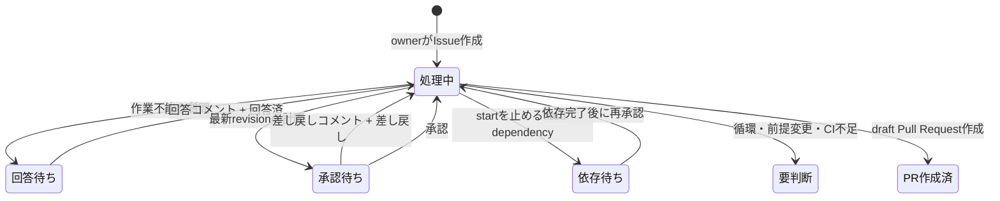

# matsu開発・リリースフロー

この文書は、複数の独立リポジトリを安全に開発・統合・リリースする手順を定めます。各アプリ固有のセットアップと品質確認は各README、サービス境界や認証などの設計は [docs](docs/README.md) を参照してください。

## 管理する3種類の状態

| 状態 | 正本 | 用途 |
|---|---|---|
| サブモジュールの取得先 | `.gitmodules` | リポジトリURLと配置path |
| ローカル開発branch | `modules.dev.conf` | 日常開発で追従するmoving branch |
| 環境別リリース | `modules.lock.conf` | 実際に使用する40桁commit SHA |

`.gitmodules` に環境やbranchの情報を持たせません。7アプリと `docs` の開発branchは `develop`、親リポジトリの統合先は `main` です。

親gitlinkはclone直後と `setup.sh` 実行後の初期位置です。リリース時の正本は `modules.lock.conf` に記録した40桁SHAです。

## タスクとPull Request

ファイルを変更する前に、ユーザーが承認したタスク一覧が必要です。承認された各タスクは、原則として1つの責務、1つのGitリポジトリ、1つのbranchで完結させます。

| 対象 | 作業branch | draft Pull Requestのbase |
|---|---|---|
| 7つの子アプリと `docs` | `codex/<task-file-stem>` | `develop` |
| 親 `matsu-workspace` | `codex/<task-file-stem>` | `main` |

タスク承認後は、対象branchの作成、commit、remoteへの公開、draft Pull Request作成まで実施できます。次の制約を常に守ります。

- `develop` または `main` へ直接pushしない。
- Pull Requestをmergeしない。mergeはユーザーが行う。
- タスク定義、実装、完了記録、同一責務のレビュー修正を同じtask branchとPull Requestに含める。
- 関係のない変更を同じbranchやcommitへ含めない。
- 子リポジトリの変更と、親のgitlink・lock更新を同じタスクに混ぜない。
- 設計や利用方法に影響しない実装変更では、機械的に文書を更新しない。

子リポジトリの `develop` から `main` へのリリースは、このタスク用Pull Requestとは別のユーザー判断です。

### タスクファイルの管理

タスクファイルは実装を所有するGitリポジトリに置き、実装commitと同じGit履歴で管理します。複数リポジトリへ変更が必要な場合はタスクファイルも分け、相互の依存関係を記載します。書式は親ワークスペースの `.agents/tasks/TEMPLATE.md` を正本とします。

ファイル名は `YYYY-MM-DD-<short-kebab-case-summary>.md` とし、日付には作成日を使います。外部の連番は設けません。作成後にタイトルを調整してもファイル名は維持し、そのstemをbranch名に使います。

```text
.agents/tasks/active/2026-08-02-auth-platform-login-ui.md
codex/2026-08-02-auth-platform-login-ui
```

タスクは次の順序で記録します。

1. ユーザー承認後、対象リポジトリでtask branchを作成する。
2. テンプレートから `.agents/tasks/active/<task-file>.md` を作成し、承認範囲、対象外、完了条件、依存タスク、優先度を記載する。
3. 実装を始める前に、タスクファイルだけをtask定義commitとしてcommitする。
4. タスクファイルの明示pathを作業担当へ渡し、実装、検証、自己レビュー、親レビューを行う。レビュー中もファイルは `active/` に置く。
5. レビュー済みの実装変更を明示的にcommitする。
6. 状態を `completed` にし、簡潔な実施結果と検証結果を記録して `.agents/tasks/completed/<完了年>/` へ移す。
7. 結果の更新と移動をtask完了commitとしてcommitする。
8. タスク定義、実装、完了記録を同じtask branchの1つのdraft Pull Requestとして公開する。公開後のレビュー修正も、承認範囲が変わらない限り同じtask、branch、Pull Requestで扱う。

同一リポジトリの実装commit SHAは、Git履歴とPull Requestから確認できるためタスクファイルへ必須記録しません。`関連コミット` は、別リポジトリの依存commitなど、task file stem・branch・Pull Requestだけでは関係を確認できない場合に限って追加します。

依存タスクは着手可否を決める制約です。着手可能なタスク間では、ユーザーの明示指定を最優先し、次に `high`、`normal`、`low`、同じ優先度では作成日の古い順に選びます。既定値は `normal` です。`high` のタスクを止めている依存タスクは実効的に `high` として先に扱いますが、派生した優先度をファイルへ重複記録しません。

完了済みタスクは年単位で保管し、過去の判断確認が必要な場合だけ参照します。キャンセルしたタスクも状態を `cancelled` として完了年のディレクトリへ移します。`active` と `completed` 以外の状態別ディレクトリ、月別階層、手動index、追加の `archive`、空ディレクトリ維持用ファイルは作りません。ディレクトリが空の場合は、次に必要になった時点で作成します。

### GitHubへの公開

local gitはbranch作成、stage、commit、検証に使用します。GitHub側のbranch、commit、Pull Requestを作成・更新するときは、GitHubプラグインがローカルの最終commit treeを安全に表現できる限り、プラグインを第一選択とします。このワークスペースでは、GitHubプラグイン付属の一般的な公開手順より `.agents/skills/publish-task-pr` の順序を優先します。

公開時は、ローカルの最終commit treeを正本として、ファイル内容、削除、mode、オブジェクト種別を保ったremote treeを作成します。既存のremote headを確認したうえで、対象task branchだけにcommitとbranch更新を行い、base branchを変更しません。公開後はremote headのtree SHAを取得し、`git rev-parse "HEAD^{tree}"` の結果と一致することを確認します。

GitHubプラグインでremote commitを構築した場合、ローカルとremoteのcommit SHAは異なることがあります。tree SHAが一致し、task file stem、branch名、Pull Requestのheadが対応していれば同じ成果として扱います。

プラグインが利用できない、またはファイル種別やremote状態を安全に表現できない場合だけ、forceを付けない `git push` をfallbackとして試します。そのプロセスには `GIT_TERMINAL_PROMPT=0` と `GCM_INTERACTIVE=Never` を設定し、新しい対話認証を開始させません。pushで認証に失敗した場合は、browser login、device login、credential保存を自動で開始しません。remote branchを公開するための認証が必要であることをユーザーへ説明し、認証または手動pushを依頼して停止します。プラグインが既にremote branchを変更した後は、自動でpushへ切り替えず、remote状態を確認してから扱います。

## GitHub Issue駆動のCodexフロー

親`matsu-workspace`のIssueを依頼と状態管理の正本とします。`.github/workflows/codex-issue-flow.yml`はdefault branchに存在するときだけ`issues.opened`、`issues.labeled`、`issue_comment.created`を処理します。repository owner以外の操作は起動対象にしません。



ユーザーが付ける`Codex:回答済`、`Codex:差し戻し`、`Codex:承認`は一時コマンドです。Actionsが信頼済みdispatchコメントを確認した後に外します。`Codex:処理中`の間に再度付けても二重dispatchせず、ラベルだけを消費します。状態表示ラベルはActionsがCodexの信頼済みresult markerから一つだけ同期します。

workflowは`contents: read`と`issues: write`だけを持ち、Issue番号単位の`concurrency.queue: max`でイベントを直列化します。Issue本文やコメントをshellへ展開せず、label/prompt対応と冪等性判定を`.github/scripts/codex-issue-flow.cjs`に集約します。同じdispatch keyの再送ではコメントを増やさず、中断した状態ラベルとコマンドラベルをreconcileします。ユーザーがmarkerを偽装してもauthorのlogin、id、typeが一致しないため制御情報として扱いません。

`GITHUB_TOKEN`によるコメントやラベル変更は別のActions runを再帰的に起動しません。Codexの外部Appが返すコメントだけを状態同期の対象にします。secretやpersonal access tokenは追加しません。

### Codex側の責務

Issueイベントは`.agents/skills/handle-github-issue-event`で判定します。専用skillはIssue全体と関連対象の現在状態、最新質問・回答・計画revision、承認後の前提変更、依存グラフを確認し、詳細処理を既存の`plan-tasks`、`coordinate-approved-tasks`、`review-changes`、`verify-changes`、`update-documentation`、`publish-task-pr`へ委譲します。

承認前は最新の信頼済み計画コメント、承認後はrepository別task fileを承認範囲と依存関係の正本とします。Pull Request本文はレビュー用投影です。IssueやPull Requestの完了はGitHub上の現在状態で再判定し、closed without mergeをコード依存の完了にしません。

依存edgeは`hard`、`soft`、`ordering`と、`start`、`complete`、`publish`、`merge`のgateを持ちます。hardだけが指定gate以降を止め、softは独立作業を止めず、orderingは公開・merge順だけを制約します。循環時は全taskを依存待ちにせず、経路、解除候補、先行可能なtaskを報告します。hard dependency待ちやCI待ちではポーリングせず、再開条件と再度付けるコマンドラベルをIssueへ残して終了します。

### Issue駆動の検証

必要なテストコードは実装に含めますが、テストスイート本体は対象repositoryの既存CIへ委譲できます。その場合はworkflowが変更責務のtest、静的解析、buildを実行することを確認し、task fileとPull Requestへ「ローカル未実行・CI委譲中」と記録します。`git diff --check`、差分確認、YAML・設定構文など軽量検証は実行できます。

コード変更を覆うCIが存在しない、またはcoverageを確定できない場合は実装前に停止します。文書だけの変更は軽量検証と残るリスクを明示できます。CI失敗後の修正は同じtask、branch、Pull Requestで行い、Pull Requestを自動mergeしません。

### default branch反映後の受け入れ試験

workflow追加Pull Requestを`main`へmergeした後、repository ownerが専用の試験Issueを作成します。Actions run、Actionsが`GITHUB_TOKEN`で投稿した信頼済み`@codex`コメント、実際のCodexタスク起動、Codex resultコメント、状態ラベル同期を順に確認します。続けて回答済、差し戻し、承認、依存待ちからの再承認、soft dependency、直接・間接循環、Pull Request状態、同一イベント再実行、処理中の再承認、owner以外の操作を試験し、最後に試験Issueをcloseします。

Actions投稿の`@codex`からCodexが起動しない場合は、推測でtokenを追加しません。Actions commentのauthor、Codex Appのinstallation/mention権限、repository設定、run logを確認し、原因と安全な代替（ownerによる手動`@codex`コメントなど）を報告します。この実地試験はdefault branch反映前には完了扱いにしません。

## 1. 開発開始

clone直後または親リポジトリ更新後は、親gitlinkの位置へ揃えます。

```sh
sh scripts/setup.sh
```

日常開発の開始時は、親の通常ファイルに変更がなく、各モジュールがcleanであることを確認し、親を `main`、各モジュールを開発branchへ同期します。

```sh
sh scripts/sync-dev.sh
```

Windowsでは次のランチャーを使用できます。

```bat
scripts\sync-dev.bat
```

`sync-dev.sh` は、親にlocal `main` が存在すること、親の通常ファイル・stage済み差分・未追跡ファイルがないこと、現在branchの `.gitmodules` と `modules.dev.conf` がlocal `main` と一致することを確認します。続けて、各モジュールがcleanで、設定された開発branchへ安全に更新できることを事前確認します。すべての確認後に親を `main` へ切り替え、各モジュールを `modules.dev.conf` のbranchへ切り替えて `origin` の最新版までfast-forwardします。親のfetchやfast-forwardは行いません。子モジュールに未commit変更、未push commit、分岐、または想定外branchがある場合も、いずれのbranchも切り替える前に停止します。

Codex Cloudでは、checkoutされた親branchを維持したまま、セットアップとCloud専用同期を順に実行します。

```sh
sh scripts/setup.sh
sh scripts/sync-dev-cloud.sh
```

`sync-dev-cloud.sh` は `setup.sh` による初期化済み状態を前提とし、親のlocal `main` を要求しません。親のbranch、HEAD、indexには触れず、全モジュールのclean状態、remote branch、現在のcheckout、local開発branchのfast-forward可否を事前確認してから、各モジュールを `origin/<開発branch>` の最新commitへfast-forwardし、nested submoduleを同期します。local-only commit、ahead、分岐、想定外branchがある場合は強制的に破棄せず、いずれのモジュールも切り替える前に停止します。

同期後に表示される未stageのgitlink差分は、Cloud作業環境を開発branchの最新へ合わせた意図した状態です。明示された親統合タスクでない限りstageまたはcommitせず、作業対象の変更と分けて扱います。

## 2. 子リポジトリまたはdocsで作業

対象リポジトリ内でタスクbranchを作成します。

```sh
cd apps/matsu-front
git switch develop
git pull --ff-only origin develop
git switch -c codex/2026-08-02-front-readme
```

実装後は対象リポジトリのREADMEやCI設定に従って、必要なformat、静的解析、build、testを実行します。変更範囲と差分を確認してから、対象ファイルだけをcommitします。

```sh
git status --short
git diff --check
git diff
git add <対象ファイル>
git commit -m "<変更内容>"
```

branchを公開し、`develop` 向けのdraft Pull Requestを作成します。公開は「GitHubへの公開」の手順に従います。Pull Requestにはタスク概要、変更内容、検証結果、懸念事項を記載します。ユーザーがレビューしてmergeするまで、親のgitlinkとlockは更新しません。

## 3. 親リポジトリで作業

親だけを変更するタスクは、`main` からtask branchを作成します。

```sh
git switch main
git pull --ff-only origin main
git switch -c codex/2026-08-02-parent-onboarding
```

対象ファイルだけをcommitし、「GitHubへの公開」の手順で `main` 向けのdraft Pull Requestを作成します。親でもbase branchへの直接pushと自己mergeは禁止です。

サブモジュール内で別タスクを作業していると、親の `git status` にgitlink差分が表示されます。その差分を親だけのタスクへstageしたり、元へ戻したりしません。

## 4. 子Pull Request merge後の統合

子アプリまたは `docs` のPull Requestがユーザーによって `develop` へmergeされた後、親のgitlinkとdevelopment lockを別タスクで更新します。

1. 変更した子リポジトリをcleanにし、作業branchをremoteへ公開済みにする。
2. 各子リポジトリを `develop` へ戻す。
3. ルートで `sync-dev.sh` を実行し、merge済みcommitへfast-forwardする。
4. `modules.lock.conf` のdevelopment lockを現在の全HEADから更新する。
5. gitlinkとlockの差分を確認する。
6. 親のtask branchへ対象差分だけをcommitする。
7. `main` 向けdraft Pull Requestを作成し、ユーザーへmergeを依頼する。

```sh
sh scripts/sync-dev.sh
sh scripts/update-lock.sh development --from-worktree
sh scripts/status.sh
git diff --submodule=log
git diff -- modules.lock.conf
```

stageするpathは明示します。次はFrontとdocsを統合する例です。

```sh
git add apps/matsu-front docs modules.lock.conf
git diff --cached --submodule=log
git commit -m "Update development module revisions"
```

`update-lock.sh` は、各HEADがoriginへpush済みのbranchまたはtagから到達できることを確認します。worktreeのcheckout、commit、pushは行いません。

## 環境別lockと昇格

環境は次の順で進めます。

```text
development -> staging -> production
```

未使用の `staging` や `production` はlockなしで構いません。利用開始前に架空SHAやplaceholderを追加せず、実際にoriginへpush済みのcommitを固定します。

現在の全モジュールHEADを指定環境へ記録します。

```sh
sh scripts/update-lock.sh development --from-worktree
```

特定モジュールだけを、branch、tag、または40桁SHAから更新できます。

```sh
sh scripts/update-lock.sh staging apps/matsu-front main
sh scripts/update-lock.sh staging apps/matsu-bff v1.2.0
sh scripts/update-lock.sh production <module-path> <pushed-40-character-commit>
```

developmentで確認したSHA一式をstagingへ昇格します。

```sh
sh scripts/promote-lock.sh development staging
```

stagingで試験したSHA一式をそのままproductionへ昇格します。

```sh
sh scripts/promote-lock.sh staging production
```

昇格時にアプリソースを修正したり、各SHAを再入力したりしません。lock変更も親リポジトリの承認済みtask branchでcommitし、`main` 向けdraft Pull Requestを経由します。

## CIでのlock適用と検証

CIは対象環境を明示し、lockを適用・検証してからbuildやdeployを行います。

```sh
sh scripts/setup.sh
sh scripts/apply-lock.sh staging
sh scripts/verify-lock.sh staging
# build、test、staging deploy
```

productionも同じ流れです。

```sh
sh scripts/setup.sh
sh scripts/apply-lock.sh production
sh scripts/verify-lock.sh production
# production deploy
```

CIのworkflow、手動入力、または環境別jobのいずれかが `staging` / `production` を明示的に選びます。branch名やtag名から暗黙に環境を推測しません。

`apply-lock.sh` は全commitをfetch・検証した後、各モジュールをdetached HEADでlockのSHAへ切り替えます。`verify-lock.sh` は全HEAD、dirty状態、40桁SHA、tag指定時の解決結果を検証します。

`apply-lock.sh` 実行後に子HEADと親gitlinkが異なり、親の作業ツリーへgitlink差分が表示されることがあります。CIの使い捨てcheckoutでは正常です。

## ローカルCompose命名

親に統合Composeは置かず、各アプリが独立したComposeを持ちます。

| モジュール | application / dependency service | container | physical named volume |
|---|---|---|---|
| `matsu-front` | `front` | `matsu-front` | なし |
| `matsu-bff` | `bff` / `bff-redis` | `matsu-bff` / `matsu-bff-redis` | `matsu-bff-redis-data` |
| `matsu-api` | `api` / `api-db` | `matsu-api` / `matsu-api-db` | `matsu-api-db-data`、`matsu-api-framework-data`、`matsu-api-vendor-data` |
| `matsu-auth` | `auth` / `auth-db` | `matsu-auth` / `matsu-auth-db` | `matsu-auth-db-data` |
| `matsu-toolbox-api` | `toolbox-api` / `toolbox-db` | `matsu-toolbox-api` / `matsu-toolbox-db` | `matsu-toolbox-db-data` |
| `matsu-arcade-auth` | `arcade-auth` / `arcade-auth-db` | `matsu-arcade-auth` / `matsu-arcade-auth-db` | `matsu-arcade-auth-db-data` |
| `matsu-arcade-api` | `arcade-api` / `arcade-db` | `matsu-arcade-api` / `matsu-arcade-api-db` | `matsu-arcade-api-db-data` |

これらはローカルruntime専用です。test / staging / production用のCompose service、profile、DB、networkはありません。`modules.lock.conf` のenvironmentはリリース対象commitの区分であり、Compose環境ではありません。

既存のphysical named volumeを継続してmountします。通常の起動・停止でvolumeを削除しません。各ランチャーはapplication serviceを一度だけ指定し、依存するDBやRedisは各repoのComposeに起動させます。

## 状態確認と安全策

```sh
sh scripts/status.sh
git status
git submodule status
git diff --submodule=log
```

- 管理スクリプトはcommitやpushを自動実行しない。
- `sync-dev.sh` は、親ではlocal `main` 不在、通常ファイル・stage済み差分・未追跡ファイル、同期定義の不一致を、子では未commit変更、未push commit、分岐、想定外branchを検出した場合に、branch切替前に停止する。
- `sync-dev-cloud.sh` は親のbranch、HEAD、indexを変更せず、子では未commit変更、local-only commit、ahead、分岐、想定外branchを検出した場合に、全モジュールの更新前に停止する。
- `update-lock.sh` と `promote-lock.sh` は、親の通常ファイルまたはstage済み差分、未追跡ファイル、dirtyな子リポジトリがある場合に停止する。
- 未stageのgitlink差分は子リポジトリ作業中の通常状態として扱うが、意図した統合タスク以外ではstageしない。
- `update-lock.sh` はoriginで確認できないlocal-only commitをlockへ記録しない。
- `apply-lock.sh` は全モジュールをfetch・検証してからcheckoutを開始し、途中で失敗した場合は変更済みモジュールを開始時のcheckoutへ戻す。
- lockを変更する前に親の通常ファイルと全サブモジュールがcleanであることを確認する。
- 旧ワークスペース `C:\work\00_Docker\matsu` は変更しない。
